# CiviCRM Processors

The following Processors are added when the CiviCRM Caldera Forms plugin is activated. Multiple processors of each type can be used to accomplish for each Caldera form.

### Contact

This processor is the one that needs to be used before others can be used, as it defines that contact the information is being applied to in CiviCRM. Rquired fields for using this processor are Contact Type and Dedupe Rule.

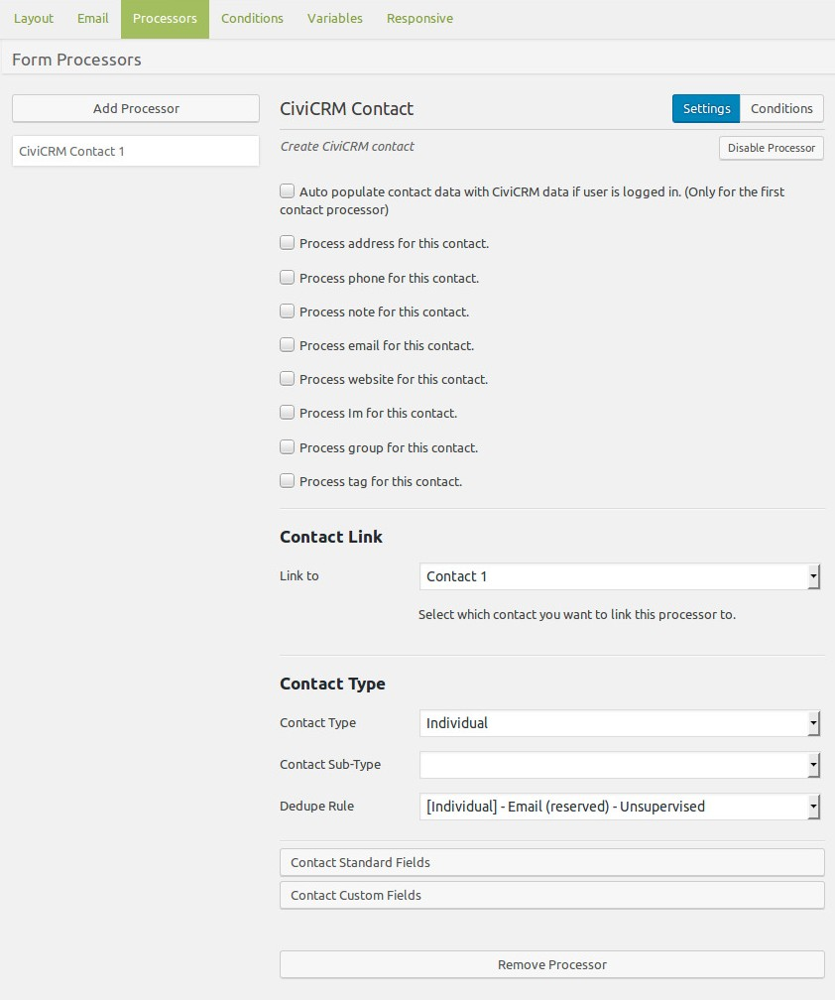

Magic Tags are used to map the fields created in the Caldera form with fields in CiviCRM, see [overview of Caldera Forms](./overview.md) for more detail on Magic Tags.

The contact processor has some of the processors outlined below built in, so that more information about the contact can be mapped in single processor. By checking more options, need selections appear.

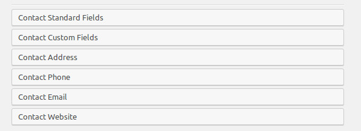

However, keep in mind that if some of the fields are not required separate processors may need to be used with condition set, see [overview of Caldera Forms](./overview.md).

### Activity

The Activity Processor provides the ability to record an activity for one more contacts on form submission. The activities available are all the activities available in CiviCRM and custom fields for those Activity Types can also be processed.

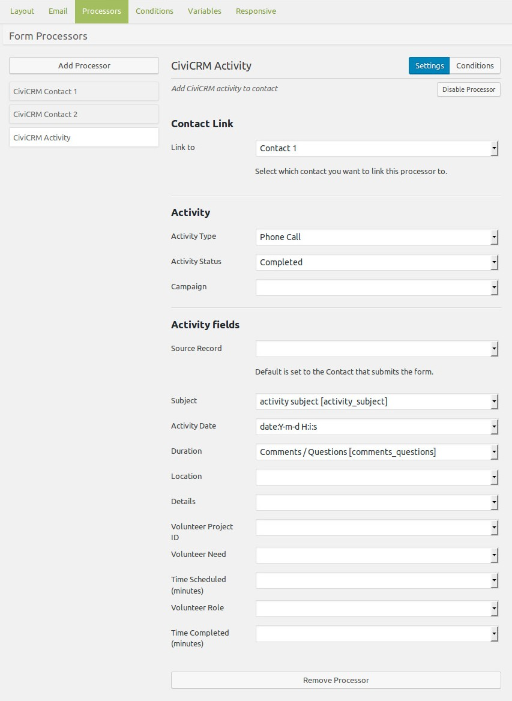

### Relationships

The Relationship processor provides a way to assign a relationship to two contacts on form submission. The Relationship Types are selected from the ones avaialbe in your CiviCRM instance.

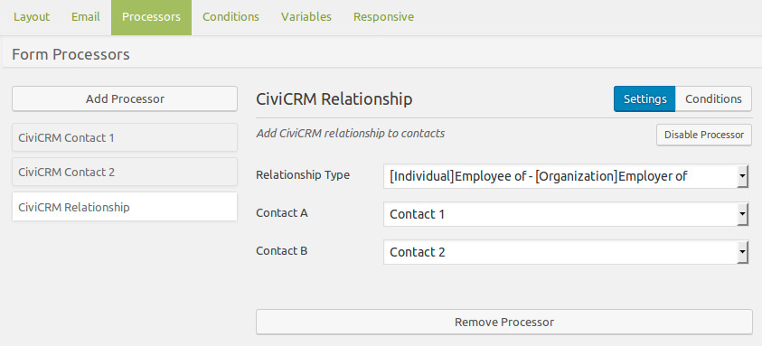

### Groups

The Group processor allows for a contact to be added to a group on form submission.

### Tags

The Tag processor allows for a tag to be added to a contact on on form submission.

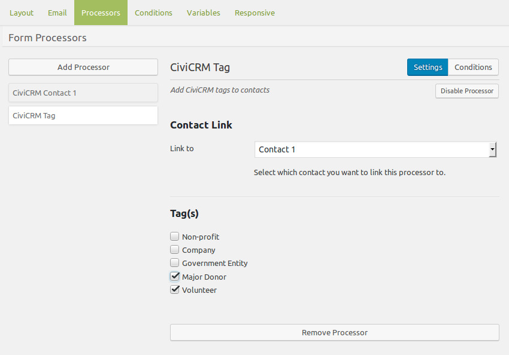

### Address

The Address processor provides the ability for a specific address type to be added or update for that contact in CiviCRM.

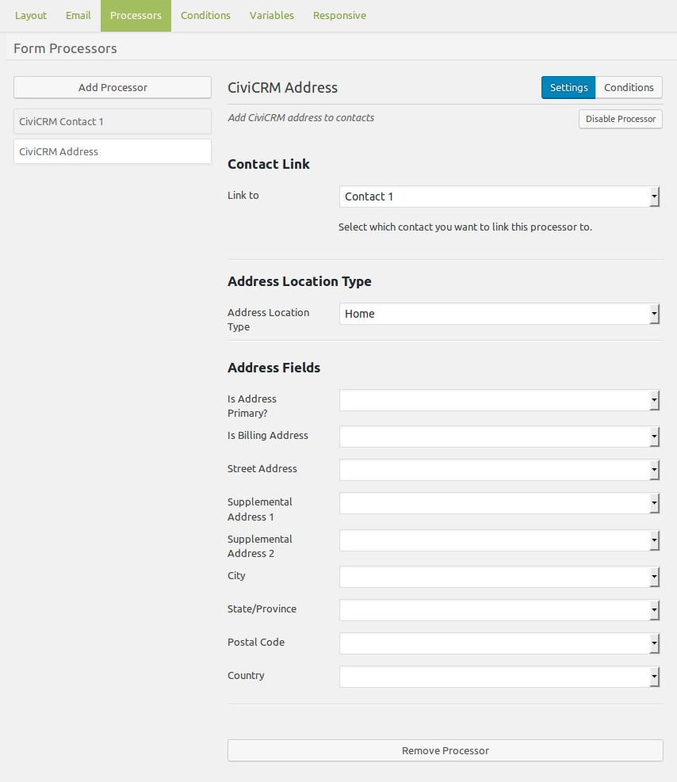

### Email

The Email processor provides the ability for a specific email address type to be added or update for that contact in CiviCRM.

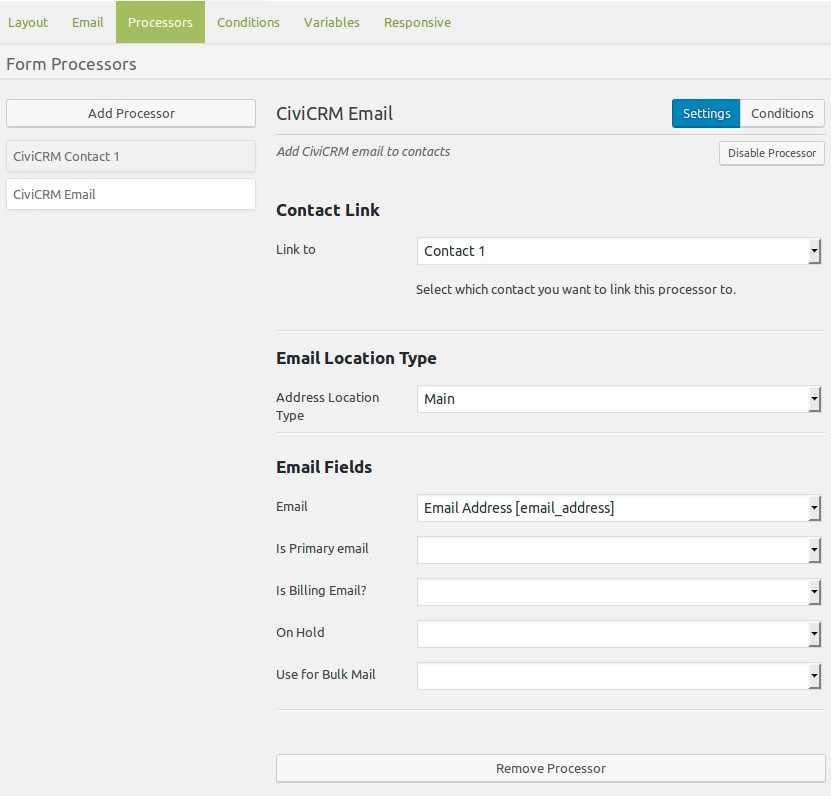

### Phone

The Phone processor provides the ability for a specific phone number and type to be added or update for that contact in CiviCRM, you'll need to select the Contact to link it too, the Phone Location Type, Phone Type and the Phone field at a minimum.

### Note

The Note processor allows for a subject and note to be added to a contact on on form submission.

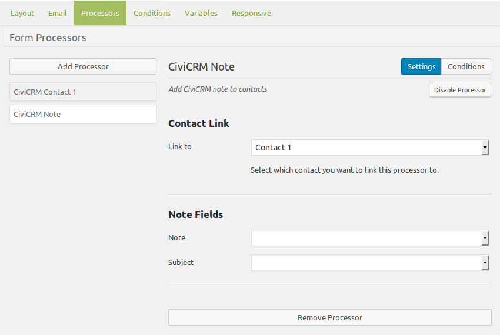

### Website

The Website processor provides the ability for a specific URL and type to be added or update for that contact in CiviCRM.

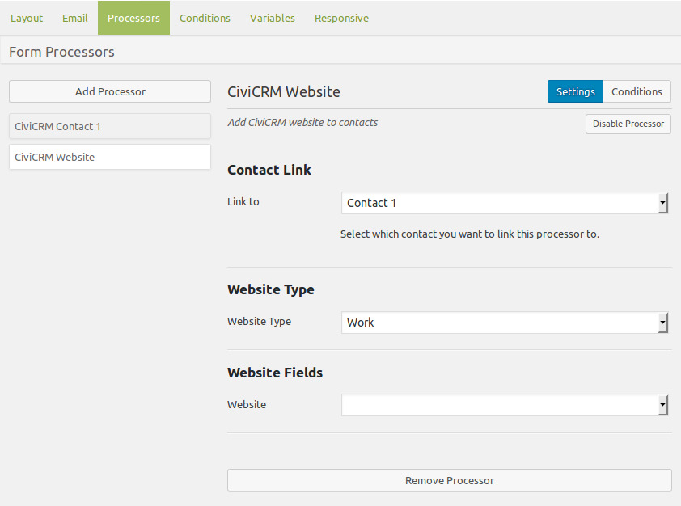

### IM (Instant Messenger)

The IM processor provides the ability for a specific IM and type to be added or update for that contact in CiviCRM.

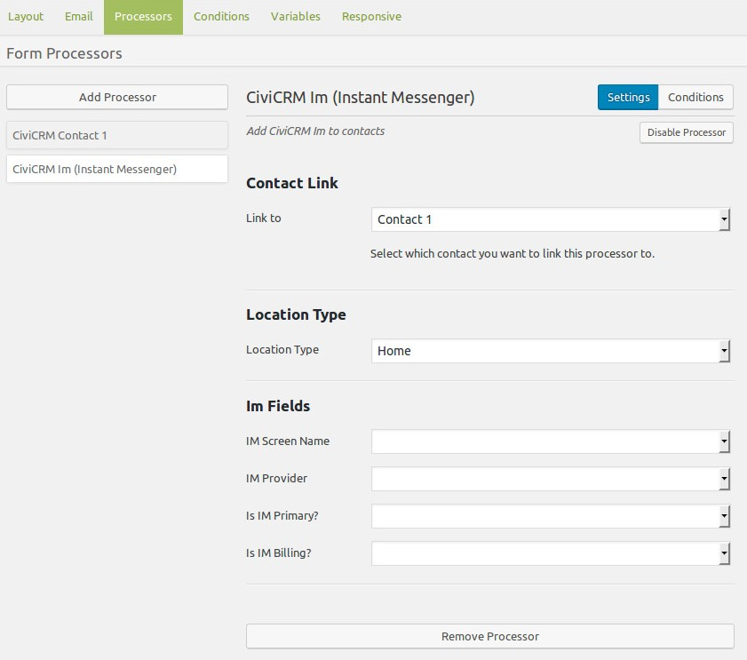

### Send Email 

If you install and enable the [E-mail API Extension](https://civicrm.org/extensions/e-mail-api) the Send Email processor becomes available and you can select from CiviCRM Message Templates a email notification that can be sent on form submission. 

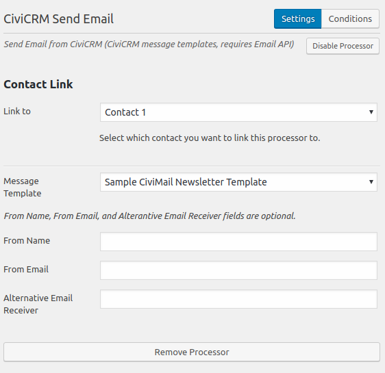

### Case

When CiviCase is enabled a Case processor is available that allows for a case to be opened on form submission. 

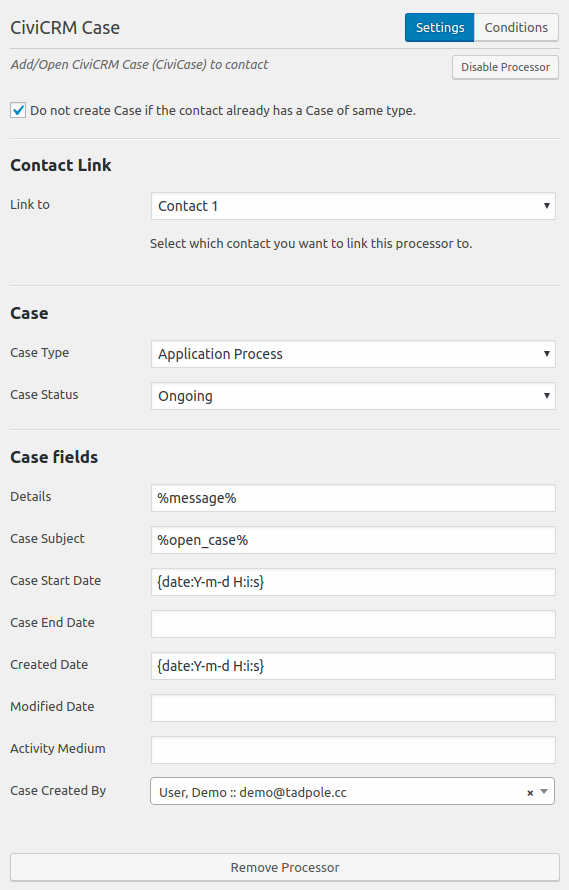

### Contributions

The CiviCRM Contribution provides a way to use a Caldera Forms calculation fields and payment processor and send contribution details to CiviCRM. 

### Memberships

The CiviCRM Membership processor provides the ability to register and renew memberships. By using this processor you can renew existing memberships as is done using a contribution page, or create new memberships at each renewal. If multiple memerships are provided, use one processor per membership. For free memberships the processor can work on it's own, for paid events use alongside the Line Item and Order processors. 

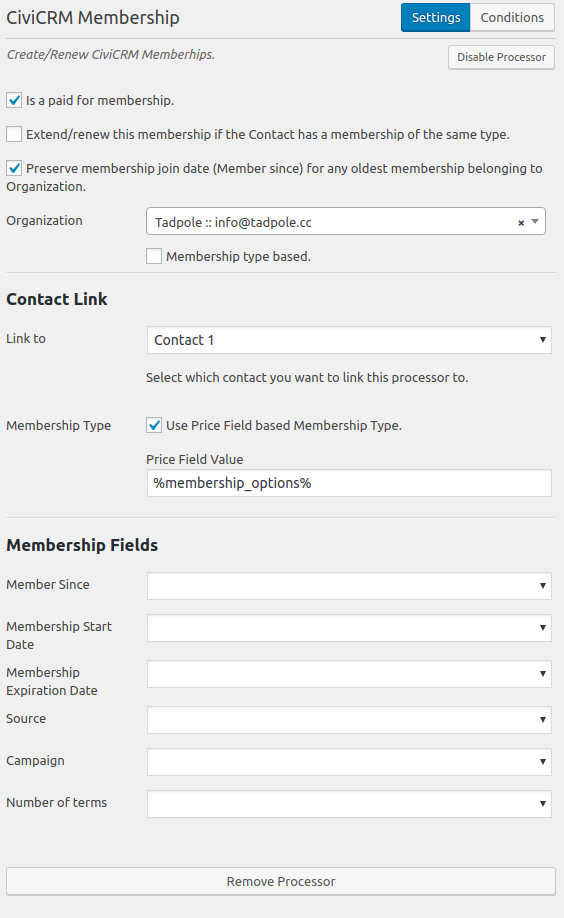

### Event Participants

The CiviCRm Participant processor provides the ability to add event registration, both free and paid, to a form. If multiple registrations are provided, use one processor per event. For free events the processor can work on it's own, for paid events use alongside the Line Item and Order processors. 

### Price Set Line Items

The CiviCRM Line Item connects Caldera form fields to Line Items in a price set to record transaction details. When using the CiviCRM Membership Processor or the CiviCRM Event Participant processor you can connect the contributions details to the membership or participant record. Once the membership or participant processor is setup a unique variable ID is created and available for selection in the Line Item processor to connect these two entities. 

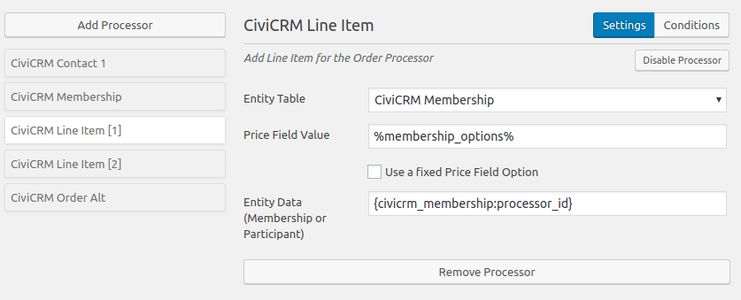

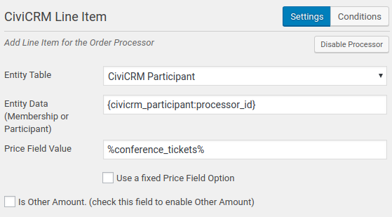

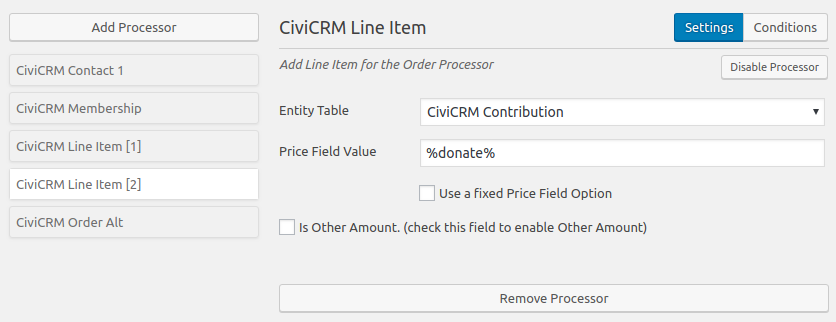

### Orders

The CiviCRM Order processor is where you can connect everything into one contribution record, by mapping all line items into one order that will be recorded on in the Contribution entity.

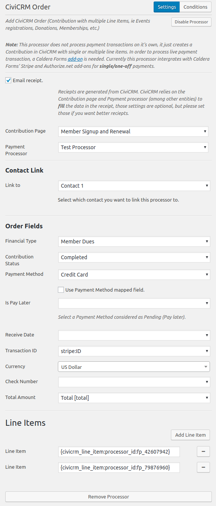

